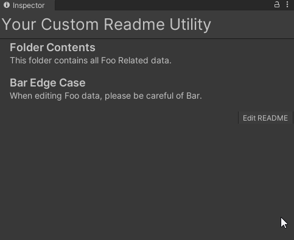
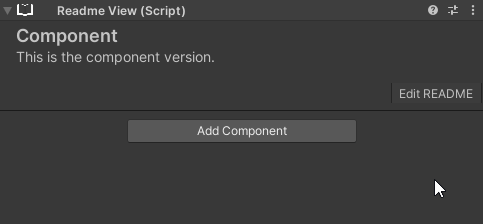

# ReadMe Utility for Unity

You can save note data for other users for your content database.

In the form of scriptable object assets.

Or components for loose game objects, such as prefab or scene work.